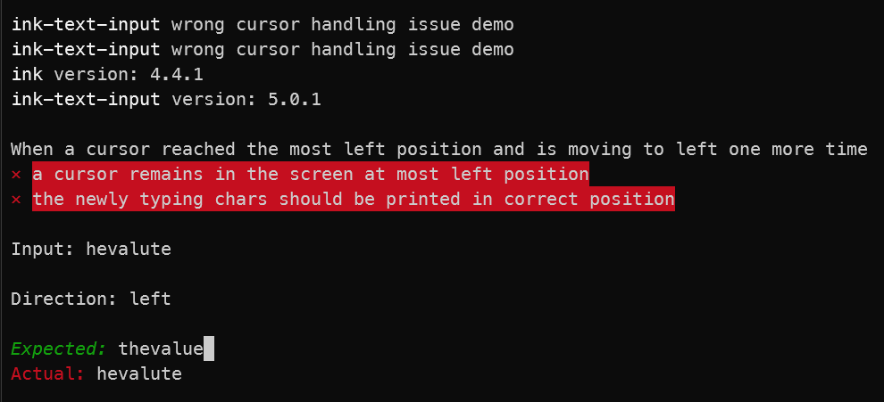
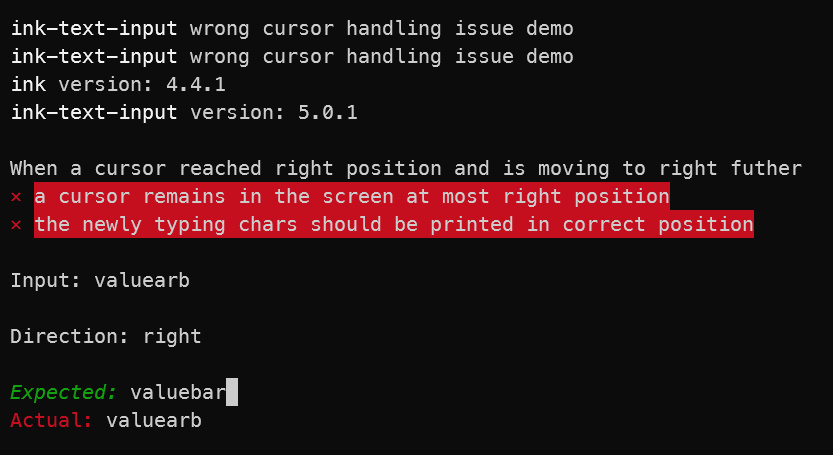
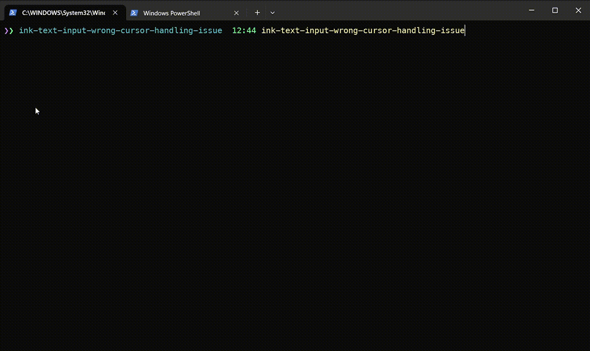

# ink-text-input-wrong-cursor-handling-issue

> Demo for ink-text-input's [wrong cursor handling issue](https://github.com/vadimdemedes/ink-text-input/issues/81)

## Setup

```bash
$ git clone git@github.com:akgondber/ink-text-input-wrong-cursor-handling-issue.git
$ npm install
$ npm run build

# Run demo app choosing either first:
$ npm run play

# or second variant:
$ npm run link
$ ink-text-input-wrong-cursor-handling-issue # or shorter variant: `itiwch`
```

## CLI

```
$ ink-text-input-wrong-cursor-handling-issue --help

  Usage
    $ ink-text-input-wrong-cursor-handling-issue

  Examples
    $ ink-text-input-wrong-cursor-handling-issue
```

## Screenshots

Left direction cursor movement handling screenshot


Right direction cursor movement handling screenshot


## Demo



## License

MIT © [Rushan Alyautdinov](https://github.com/akgondber)
